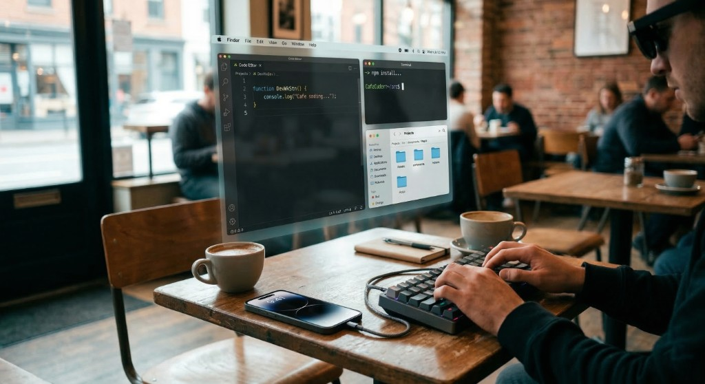

## macOS on iPhone – Research & Roadmap

This repo tracks an open-source effort to understand what it would take to run macOS on iPhone-class hardware (starting from iPhone 17 targets), inspired by projects like Asahi Linux and Project Sandcastle and by Apple’s own MacBook Neo running macOS on an A-series SoC.

Short explainer video (8–10s) of the same minimalist dev setup:

- [`Minimalist_Dev_Setup.mp4`](assets/video/Minimalist_Dev_Setup.mp4)

### End goal

Use a single iPhone as a practical dev machine: **macOS on iPhone + Xreal glasses as the monitor + a keyboard**, with internet provided by nearby **Wi‑Fi** (MVP first; cellular later).

The near-term goals are:

- **Document** the boot, security, and hardware model of modern iPhones from a macOS/dual-boot perspective.
- **Build tooling** (in Python, later Rust) to inspect IPSWs, Image4 payloads, device trees, and firmware layouts.
- **Map and prototype** the driver/service stack needed for a usable “macOS on iPhone” environment, focusing on external display + keyboard + Wi‑Fi for a developer workflow.

> The current detailed plan lives in `.cursor/plans/macos_on_iphone_roadmap_d617d64e.plan.md` in this workspace. As this project matures, that content will be mirrored into the docs and website.

### Repository layout (planned)

- `docs/` – architecture, hardware notes, driver docs, security model, status matrix.
- `tools/` – Python tooling for firmware extraction, IPSW/Image4 analysis, and status reporting.
- `experiments/` – self-contained “lab” experiments (boot logs, DTB mapping, etc.).
- `specs/` – schemas and interface definitions (firmware bundle format, status JSON, etc.).
- `site/` – Hugo-based website that renders the docs and status in a friendly way.

See `THIRD_PARTY.md` for how this project depends on existing open-source tools instead of reimplementing everything from scratch.

